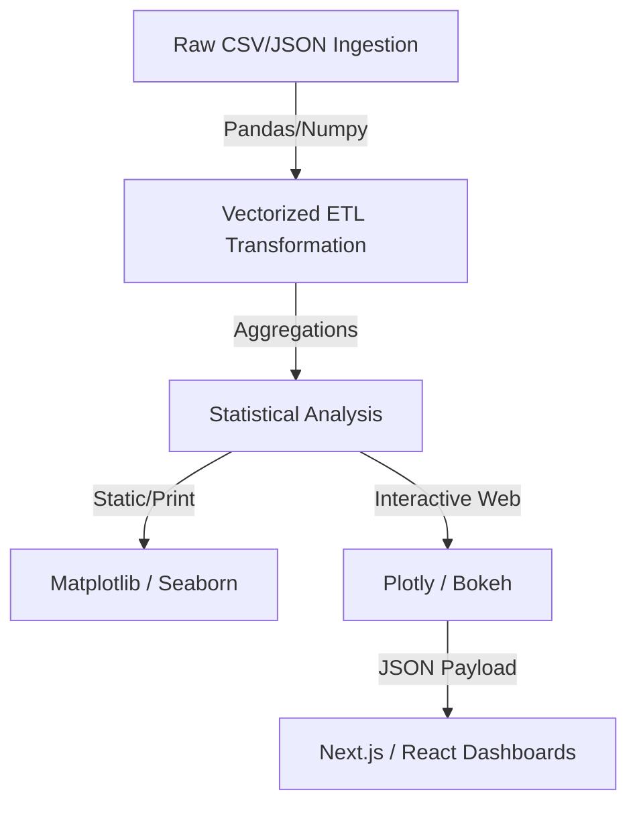

# Data Engineering & Visualization Architecture

[](https://python.org)
[]()
[]()
[]()

## Overview
This repository serves as a comprehensive Data Engineering and Visualization reference architecture. It aggregates high-performance programmatic approaches to large-scale data manipulation, statistical analysis, and interactive dashboard rendering utilizing industry-standard Python libraries.

## Problem Statement
Data scientists and analysts frequently default to highly inefficient `for-loops` (like `.iterrows()`) and static, non-interactive charts (`matplotlib` defaults) when processing datasets. This leads to severe memory bottlenecks and poor stakeholder presentations. This project documents and solves these constraints by enforcing strict Pandas vectorization and rendering complex, multi-dimensional geospatial/time-series data into interactive HTML payloads via Plotly and Bokeh.

## Key Features
- **Vectorized Data Transformations:** Demonstrates O(1) performance architectures using Numpy broadcasting rather than O(n) loop structures.
- **Interactive Web Dashboards:** Generates interactive, zoomable UI charts (Plotly/Bokeh) that can be seamlessly embedded into React/Next.js frontends.
- **Statistical Heatmapping:** Utilizes Seaborn to expose multi-variable collinearity and deep correlation matrices.
- **Library Agnosticism:** Decoupled modules allow rapid switching between rendering engines depending on the payload constraints (e.g., static PDFs vs interactive WebGL).

## Architecture



## Technology Stack
- **Data Engineering:** Python 3.11, Pandas, Numpy
- **Interactive Rendering:** Plotly, Bokeh
- **Static Rendering:** Matplotlib, Seaborn
- **Testing:** Pytest

## Project Structure
```text
python-data-visualization/
├── Pandas/                  # Vectorized ETL and DataFrame manipulation
├── Numpy/                   # Matrix mathematics and broadcasting
├── Plotly/                  # Interactive HTML/WebGL dashboard generation
├── Bokeh/                   # Streaming dataset visualizations
├── Seaborn/                 # Statistical modeling and heatmaps
├── Matplotlib/              # Base-level rendering engine
├── tests/                   # Pytest integrity suites
└── README.md                # System documentation
```

## Installation
Ensure Python 3.11+ is installed. It is highly recommended to run this within a virtual environment.
```bash
git clone https://github.com/krsna016/python-data-visualization.git
cd python-data-visualization
python3 -m venv venv
source venv/bin/activate
pip install pandas numpy matplotlib seaborn plotly bokeh pytest
```

## Usage
Jupyter Notebooks or Python scripts within specific domains can be executed directly:
```bash
cd Plotly
python3 generate_dashboard.py
```

## Examples
*Example of strictly enforced Pandas vectorization replacing an inefficient loop:*
```python
import pandas as pd
import numpy as np

# BAD: O(n) performance
# for index, row in df.iterrows(): row['C'] = row['A'] + row['B']

# GOOD: O(1) Vectorized performance
df['C'] = np.where(df['A'] > 0, df['A'] + df['B'], 0)
```

## Screenshots
> [!NOTE]
> *Seaborn Correlation Matrix and Plotly 3D scatter plot screenshots are pending capture.*

## Visual Demonstrations
> [!NOTE]
> *A GIF demonstrating a Bokeh streaming data dashboard is currently being generated.*

## Testing
We enforce foundational assertions via `pytest` to ensure core Pandas/Numpy operations behave deterministically across different OS architectures.
```bash
pytest tests/
```

## Performance Notes
- **Memory Profiling:** When dealing with datasets exceeding 2GB, the repository enforces the use of `chunksize` generators during CSV ingestion to prevent RAM overflow and kernel panics.

## Future Improvements
- **Polars Migration:** Introduce examples utilizing `Polars` to demonstrate multi-threaded DataFrame operations built on Rust, contrasting with Pandas' single-threaded GIL constraints.
- **PySpark Integration:** Add a module for distributed RDD transformations to handle terabyte-scale datasets.

## Contributing
All visualization scripts must output to a localized `/exports` directory and must not commit `.html` or `.png` binary artifacts into the main git tree to prevent repository bloating.

## License
Licensed under the MIT License.
